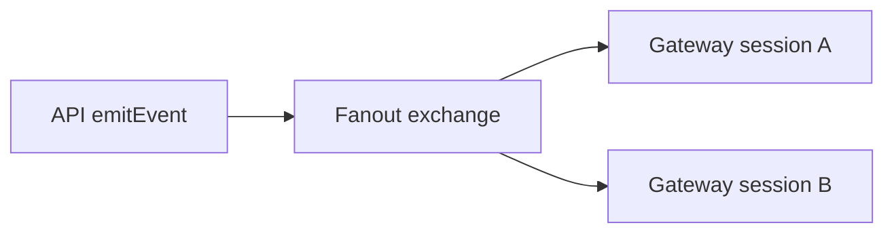

# Beautiful Mermaid for Obsidian

An Obsidian plugin that renders Mermaid diagrams with `beautiful-mermaid` SVG output and Obsidian theme variables.


Inspired by Craft's [Beautiful Mermaid gallery](https://agents.craft.do/mermaid) and powered by [`lukilabs/beautiful-mermaid`](https://github.com/lukilabs/beautiful-mermaid).

## Usage

Use a `mermaid` code block:

````markdown

````

Aliases are supported:

- `mermaid`
- `mermaid-beautiful`
- `beautiful-mermaid`
- `bmmd`

## Build

```bash
bun install
bun run build
```

## Install Into A Vault

Copy these files into:

```text
<vault>/.obsidian/plugins/beautiful-mermaid-renderer/
```

Required files:

- `manifest.json`
- `main.js`
- `styles.css`

Enable **Beautiful Mermaid** from Obsidian settings.

Reading view and Live Preview are both supported. In Live Preview, move the cursor outside the code block to see the rendered diagram; use the hover **Edit** button to reveal the source again.

Inline diagrams fit to the editor width by default so the whole diagram is visible. Disable **Fit diagrams to width** in plugin settings to use readable-height scaling with horizontal scrolling.

## Preview


The preview SVGs are generated locally from Mermaid source:

```bash
bun run assets
```

## Release Files

Manual install needs:

- `main.js`
- `manifest.json`
- `styles.css`

## Development

```bash
bun run dev
```
